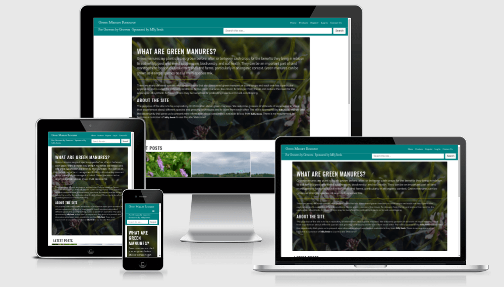
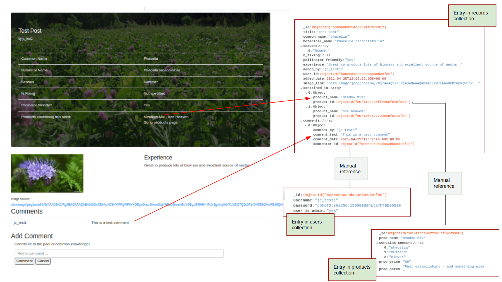
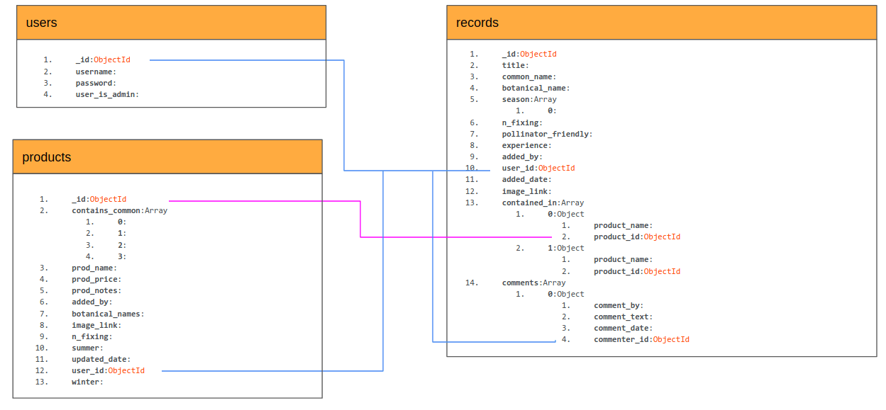
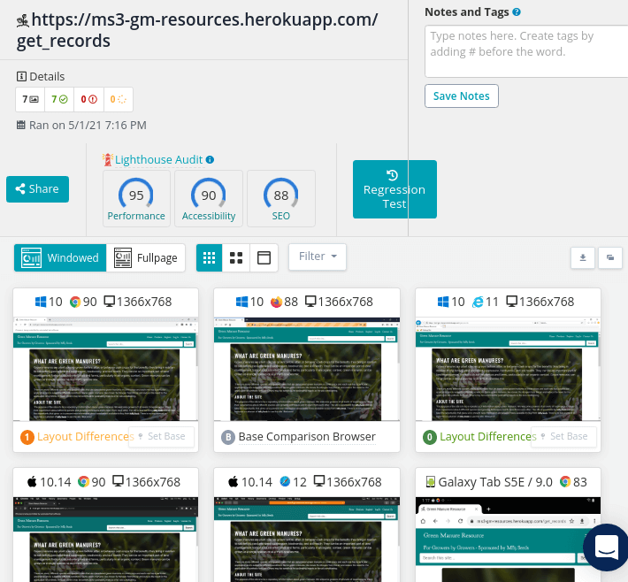

# Green Manure Resource <!-- omit in toc -->

The Green Manure Resource is an online learning and experience-sharing space for organic growers to share their thoughts on the use of different green manures. It is sponsored by a seed company that also presents product information on the site.

<a href="https://ms3-gm-resources.herokuapp.com/" target="_blank">View the live project here</a>



# Table of Contents <!-- omit in toc -->  
- [Scenario Outline / Strategy](#scenario-outline--strategy)
- [User Experience](#user-experience)
  - [User Stories by User Type](#user-stories-by-user-type)
    - [First-time or Infrequent Vistor](#first-time-or-infrequent-vistor)
    - [Contributing or Frequent User](#contributing-or-frequent-user)
    - [MS3 Seeds Admin User](#ms3-seeds-admin-user)
    - [Site Owner](#site-owner)
- [Design - UI](#design---ui)
    - [Wireframes](#wireframes)
    - [Colour](#colour)
    - [Typography](#typography)
    - [Images](#images)
      - [Cards](#cards)
- [Design - Database](#design---database)
- [Features](#features)
    - [User Perspective](#user-perspective)
    - [Admin Perspective](#admin-perspective)
    - [Site Owner Perspective](#site-owner-perspective)
    - [General](#general)
    - [Future Features](#future-features)
- [Technologies Used](#technologies-used)
    - [Additional Services](#additional-services)
    - [UI-Content Sources](#ui-content-sources)
    - [IDE, Version Control, Storage, and Deployment](#ide-version-control-storage-and-deployment)
- [Testing](#testing)
  - [Specific Test Cases and Code Validation](#specific-test-cases-and-code-validation)
  - [General UX Testing](#general-ux-testing)
  - [Smartbear Cross Browser Testing](#smartbear-cross-browser-testing)
- [Known Issues](#known-issues)
- [Deployment](#deployment)
    - [Deploy to Heroku](#deploy-to-heroku)
    - [Connect MongoDB and Create PyMongo Instance](#connect-mongodb-and-create-pymongo-instance)
      - [Note on Environment Variables](#note-on-environment-variables)
  - [Forking](#forking)
- [Credits](#credits)
  - [Images](#images-1)
  - [Code](#code)
    - [Issue 1 - Inserting Comments in the DB Documents](#issue-1---inserting-comments-in-the-db-documents)
    - [Issue 2 - Handling product Info](#issue-2---handling-product-info)
    - [Issue 3 - Handling Updates](#issue-3---handling-updates)
    - [Issue 4 - Delete Functionality for User Records with Modal Confirmation](#issue-4---delete-functionality-for-user-records-with-modal-confirmation)
    - [Jumbotron Styling](#jumbotron-styling)

# Scenario Outline / Strategy
Although the practice of restoring land with the use of certain crops is as old as the history of farming, it is a practice around which there is renewed interest, especially in the area of organic or regenerative farming and among small scale producers and homesteaders. The primary purpose of the site is to provide a dedicated online space for interested growers to share thoughts and experiences of using different green manure crops. Growers who have some interesting facts to relate can do so in an informal yet factual way and the information they provide is laid out in a consistent and easy to follow format.

In parallel with this goal, the site is hosted by a fictional seed company:

**MS3 Seeds** is a niche supplier of seeds, specialising in <a href="https://en.wikipedia.org/wiki/Green_manure" target="_blank">green manures</a>.
It has set up this site to do the following:
* Generate awareness for their company among the relevant community of growers
* Establish their name as a recognized thought leader in the area
* Establish their name as being a trustworthy and open source of unbiased information as well as quality seeds
* Generate customers by facilitating an easy through-flow from the information-sharing site to the store
* Build a community of growers who automatically think 'MS3 Seeds' when they think of green manure

# User Experience
There are 3 user types currently envisaged for the site:
* Infrequent or first-time vistor who has not registered as a user
* Contributing users who may add posts or comment on other contributors' posts
* Admin user who represents MS3 seeds in the posts and comments and who also has the ability to add or update the specific products shown as available from MS3 Seeds

## User Stories by User Type
### First-time or Infrequent Vistor
* As a first-time visitor, the purpose and overall content of the site is clear and easy to navigate. I can see additional contact info - phone, address, social media and I can view all content - ie user posts and product info.  [Test Case](readme_assets/testing.md#as-a-first-time-visitor-the-purpose-and-overall-content-of-the-site-is-clear-and-easy-to-navigate)
* I can search for a term and see results in user posts and separately, results in the 'MS3 Seeds' product information. [Test Case](#as-a-non-registered-or-logged-in-user-i-can-use-the-search-functionality)
* I can read all content but I cannot comment on posts. [Test Case](readme_assets/testing.md#as-a-non-logged-in-user-i-cannot-post-a-comment-by-going-directly-to-the-url-for-adding-a-post)
* I can contact MS3 seeds directly from the site without having to register as a user [Test Case](readme_assets/testing.md#as-a-non-logged-in-user-i-can-use-the-contact-form)
* I can easily register to become a contributing user of the site. [Test Case](readme_assets/testing.md#as-a-non-logged-in-user-i-can-register-on-the-site-including-client-side-validation)
* As a registered user, my username cannot be taken or duplicated by another user. [Test Case](readme_assets/testing.md#as-a-new-user-trying-to-register-i-cannot-use-a-username-already-taken-server-side-validation)

### Contributing or Frequent User
* I can view posts by other users and comment on any posts that interest me or where I want to communicate with the poster. [Test Case]((readme_assets/testing.md#i-can-add-a-comment-on-an-existing-post-when-logged-in))
* For any post that interests me, I can easily navigate from the post directly to the relevant MS3 product or products that contain the species that is the topic of the post. This may be to get purchase information, or to consult the additional information provided by MS3 Seeds on that particular seed type. [Test case covered by admin user story](readme_assets/testing.md#when-a-user-adds-a-post-the-app-automatically-adds-the-related-product-info-if-applicable)
* I can choosse to view, update or delete any post that I have previously submitted [Test Case](readme_assets/testing.md#as-a-user-who-has-previously-submitted-comments-i-have-te-option-to-edit-these-when-logged-in)
* I cannot easily delete a post by mistake as there is a confirmation required. [Test Case](readme_assets/testing.md#as-a-user-who-has-previously-submitted-comments-i-can-choose-to-delete-them)
* I feel like a valued member of the discussion community with a custom message from MS3 Seeds on my profile page. [Test Case](readme_assets/testing.md#as-a-registered-user-i-get-a-personalized-message-from-ms3-seeds)
* If I have any website issues, I can use the contact form without being logged in to submit a support request. [Test Case - already mentioned above](readme_assets/testing.md#as-a-non-logged-in-user-i-can-use-the-contact-form)
    
### MS3 Seeds Admin User
* In addition to the post/comment functionality of a contributing user, I also have the option to administer the products. That means, I can add details for a new product, update existing details for a product (add or remove a particular species from a seed mix, for example) or delete a product from the list. [Test Case](readme_assets/testing.md#as-an-admin-user-i-can-add-or-edit-products)

### Site Owner
* The site presents a positive image for the brand
* The site facilitates the emergence of a discussion community around green manures with the brand name central to that discussion
* Sales Generation: When any user adds a post, they must enter the 'common name' of the plant species that is the topic of their post. This is automatically used as a search criteria against all seed mixes and a link is automatically inserted on the post to link readers to the corresponding product. See [here](readme_assets/testing.md#when-a-user-adds-a-post-the-app-automatically-adds-the-related-product-info-if-applicable)

# Design - UI
### Wireframes
Before development began, the basic layout of the site was set out in wireframes.

The basic design follows a single column design and is consistent between mobile and desktop. The deviations occur on the home page, where the 'latest posts' cards are displayed in rows of 3 on Bootstrap md size and above, and singly on smaller screen sizes.
Similarly, on the page displaying the contnet of a user post, the image (if provided) and 'Experience sectins are displayed next to each other horizontally on larger screns sizes and vertically on smaller screen sizes.

* [Wireframe - Mobile or tablet](readme_assets/wireframes/MS3_GreenManure_Mobile.pdf)
* [Wireframe - Desktop](readme_assets/wireframes/MS3_GreenManure_Desktop.pdf)

### Colour
The main colours used are teal, gold, white.
Teal aligns with the 'natural, 'green' focus of the site.
Gold is used sparingly for some hover events (social media icons) or minor UI elements (horizontal rule).
White is used as the text icon colour against the teal background or against darker image backgounds. Otherwise, text is standard black. 

### Typography 
The site uses several fonts:
[Oswald](https://fonts.google.com/specimen/Oswald), [Raleway](https://fonts.google.com/specimen/Raleway) and [Goudy Bookletter 1911](https://fonts.google.com/specimen/Goudy+Bookletter+1911#standard-styles) are all Google fonts.
Oswald and Raleway are used throughtout the site content to provide a neutral, modern look.
Goudy Bookletter was chosen as a font to distinguish the brand of the sponsor, MS3 seeds. As such it is used in the page header and footer. The main aspect of the font that made it a good choice was the styling of the figure '3'. It sits across the bottom line of the text and is reminiscent of a germinating seed.
 

### Images
Images are a central part of the site 'data'. As they convey information and are not simply a design element, they are used sparingly outside of the dedicated image spaces.
The main image for the jumbotron has an overlay to prevent easy identification of the species but allow the theme of the site to come through. To make it clear that the jumbotron image is 'design' and not 'content', the same image is used on different pages regardless of species.
To differentiate pages that arise from the MS3 Seeds shop, the overlay becomes white rather than the default dark.

#### Cards
Latest posts are displayed as (Bootstrap) cards with image tops. The image in the card should match the image provided by the user for that post. However, the *Image URL* field is not mandatory for a user post. Therefore, as there may be cards that do not have a specified image, a default image is used. This keeps the presentation of the latest posts correct. Only one default image is used and it is quite unspecific, indicating to the user (especially any frequent user) that it is a default image.

**Note:** The deafult/fallback image is used only for the cards - inside the post itself, no image appears unless it has been specified by the user.

# Design - Database
The app uses MongoDB as the database. MongoDB is a NoSQL (non-relational) database and stores data in documents, as opposed to the tables of traditional relational databases. As such, it is capable of working with unstructured data. While the database is non-relational - connections between database 'collections' are established to aid clear data structure and avoid any future issues regarding the MongoDB size limit for a single document (16MB). 

Essentially, the design was set up in accordance with the following MongoDB principle "data that is accessed together should be stored together". The rationale here is that if all the data returned for a given query can be returned in a single call to one db document, it allows for very fast/efficient operation. Along with this, manual references are established between collections to allow easy follow-on queries where these are likely. (For more info, see: https://docs.mongodb.com/manual/reference/database-references/#std-label-document-references)

An example of this in practice in the app is the record for a single user post:
 

* The entry for the record embeds the comments for that record. The comments are displayed together with the rest of the post content and the use case for the app makes it unlikely that there would ever be sufficient comments to approach the document size limit.
* Each comment entry is itself an object containing the 4 key:value pairs - comment text, commenter ID, date, and user name. The commenter_id is a reference to an ObjectId in the users collection.
* A similar approach is taken with the 'conatained_in' key. This is an array of objects, with each object containing two key:value pairs. The first key value is the product_name for display together with the rest of the post data (no separate query required to get this). The second key:value pair contains the product_id as an ObjectId in the products collection.



# Features
### User Perspective
* Functionality for a user to register with the site
* Functionality for a registered user to sign in
* Functionality for a signed-in user to add a post
* Functionality for a signed-in user to add a comment
* Functionality for a signed-in user to manage their profile - that is, to edit or delete posts that they have created previously
* Functionality for a signed-in user to log out
  
### Admin Perspective
* Functionality to add a new product listing
* Functionality to edit an existing product listing
* If I don't have price information to hand, the app automatically populates the price field with a message (eg 'Contact us')

### Site Owner Perspective
* Users experience a clear, welcoming, and informative space
* Users that are active on the site feel valued (eg custom message on reaching a certain number of posts)
* When a user adds a post about a particular species, the system autiomatically searches the contents of all listed products to check if it is conatined in any of them. If it is, the name of the product is automatically added to the post content allowing a user to easily navigate from a post to a related product page.
* Site navigation is dynamically generated depending on user status (not signed in, signed in, signed in and admin) so that no unauthorized editing of product or price information is posible.
* Contact form has validation so the database is not muddied with invalid or useless data
* Sign in has validation so that a user cannot take a username already used
* A footer provides additional contact info and links to social media

### General
* Site displays well and is user-friendly on all device sizes (responsive design)
* Easy to digest home page that clearly indicates the site purpose and contains links to the latest posts in a visually appealing way
* Contact page that allows any user (logged in or not) to contact the site
* Navigation is clear and functions as expected

### Future Features
For the next iteration, the following features are on the wish-list:
   * Integrate shopping cart functionality for online sales
   * Allow direct upload of user images
   * Support conversation threads in the comments
   * Add a 'notify me' or subscribe function whereby users who have opted in get notified when there is a new post

# Technologies Used
* MongoDB
  
  [MongoDB Atlas](https://www.mongodb.com/cloud/atlas/lp/try2?utm_source=google&utm_campaign=gs_emea_ireland_search_core_brand_atlas_desktop&utm_term=mongodb%20atlas&utm_medium=cpc_paid_search&utm_ad=e&utm_ad_campaign_id=12212624527&gclid=Cj0KCQjwppSEBhCGARIsANIs4p4TIAFshh9aJ1kpUVX5dc5NMR76hqbUMaLzzFHHQUtV0I4SMHnlS2gaAmQ7EALw_wcB) is the database provider for the application.

*  [Python](https://www.python.org/downloads/release/python-388/) (3.8.8) and several Python-related frameworks and libraries are used to build the main functionality, in particular:
   *  **Flask** is a Python-based micro-framework for developing web applications. See [Flask documentation](https://flask.palletsprojects.com/en/1.1.x/).
   *  **Jinja** is a templating engine that works with Flask to speed up the development process and aid development using HTML templates. See [Jinja documentation](https://jinja.palletsprojects.com/en/2.11.x/)
   *  **Werkzeug** is a Web Server Gateway Interface (WSGI) library. In this application, it has primarily been used to handle password hashing. See [Werkzeug documentation](https://werkzeug.palletsprojects.com/en/1.0.x/)
   *  **Flask-PyMongo** serves as a way of providing the communication required between the Flask app and MongoDB. See [Flask-PyMongo docs](https://flask-pymongo.readthedocs.io/en/latest/#flask_pymongo.PyMongo)
   *  There are several other minor dependencies that are outlined in the app's rquirements.txt file:
      *  click==7.1.2
      *  dnspython==2.1.0
      *  Flask==1.1.2
      *  Flask-PyMongo==2.3.0
      *  itsdangerous==1.1.0
      *  pymongo==3.11.3
      *  Werkzeug==1.0.1 
  

* [HTML](https://developer.mozilla.org/en-US/docs/Web/Guide/HTML/HTML5) is used to build the page layouts.
* [CSS](https://developer.mozilla.org/en-US/docs/Glossary/CSS) is used, to provide visual styling.
* [Bootstrap](https://getbootstrap.com/) is used to provide responsive layout elements such as the 'card', 'jumbotron' and modal window elements.
* [Javascript](https://developer.mozilla.org/en-US/docs/Glossary/JavaScript) is used to provide the support for EmailJS and form validation.

### Additional Services
* [SmartBear Crossbrowser Testing](https://crossbrowsertesting.com/) was used for testing.
* [EmailJS](https://www.emailjs.com/) provides the contact form -> email functionality. 
* [TinyJPG](https://tinyjpg.com/) was used to comptress image files.
* [Balsamiq](https://balsamiq.com/) was used to create wireframes.
* [Randomkeygen](https://randomkeygen.com/) was used to generate the secret key.
* [Google Slides](https://www.google.com/slides/about/) was used to create the DB schema.
    
### UI-Content Sources
* [Unsplash](https://unsplash.com/) was used to source images. For specific credits, see the Credits section of this doc.
* [FontAwesome](https://fontawesome.com/) was used to source icons.
* [Google Fonts](https://fonts.google.com/) was used to source fonts.
* [Icon Archive](https://iconarchive.com/browse.html) was used to source the favicon.

### IDE, Version Control, Storage, and Deployment
[GitPod](https://www.gitpod.io/) was used for all development
[git](https://git-scm.com/)(git add, git commit, git push) is used to handle version control 
[GitHub](https://github.com/) stores all the project files 
[Heroku](https://www.heroku.com/home) was used for deploying the live site and the configuration ensures autonatic deployment from the GitHub repo when new code is pushed.

# Testing
## Specific Test Cases and Code Validation

For individual test case details and validation results see [Testing](readme_assets/testing.md).

## General UX Testing
In addition to the specific test cases above, cross-browser and multi-device testing was carried out by myself and some family members. The purpose of these was to find any issues with display or functionality on mobile, tablet or laptop devices using a variety or browsers. 
Test case: Test appearance across the site, particularly Home/landing page, individual post page, contact form:

Opera on laptop (Linux Ubuntu) - tested appearance, search, contact form. Result: ok
Firefox on laptop (Linux Ubuntu) - as above
Chrome on laptop (Linux Ubuntu) - as above
Chrome laptop (Windows) - 
Firefox on laptop (Windows) - 
IE on laptop (Windows)
Safari on iPad - 
Chrome on iPad - 
Safari on iPhone - 
Chrome on Android (Moto G7) - 
Chrome on Mac - 
Safari on Mac - 

## Smartbear Cross Browser Testing
The site has also been checked using a trial account with [SmartBear CrossBrowserTesting](https://crossbrowsertesting.com/).

The trial version allows testing on a variety of virtual device and browser combinations. It facilitates live testing and screenshot testing.
At the link you can view a recording of a live test on a virtual Mac OSX 10.14 using Google Chrome 90: 

[Watch Test](https://app.crossbrowsertesting.com/public/i484cf03e80ef0a1/livetests/61792521/videos/zd24a9ac46468b8b5f4a?test_hash=cbbf1e3b)

Screenshot test [result](https://app.crossbrowsertesting.com/public/i484cf03e80ef0a1/screenshots/z4e34afe96c476ba28bd):


# Known Issues 

* Although the search functionality is working well, there is an issue with the sorting of returned results. A text index has been set up on the records collection with a weighting applied to different fields. This appears to be not working exactly as intended at the moment, particularly in relation to how it handles embedded (comments) content. Internet searches have shown this to be an issue that has caused problems for other users. I have not managed to fix it yet. However, from the point of view of the user, i think they would be unaware tht this feature is not working exactly as intended.

* There is an issue when a user enters more than one 'common name' for a post topic. This displays ok but the related products are not picked up. This is poor design rather than implementation as it has been built to work with just one entry at a time. This would be something to fix in the next iteration of the app.

# Deployment
The deployment steps below are the procedure followed for this app. 
The order of steps is based on that followed for the task manager walkthrough project.
** Note: The required environment variables are not contained in the README. Deployment will fail without access to these variables.** 

### Deploy to Heroku
1. Create a requirements.txt file. In (Gitpod) terminal, type:
   ```shell
   pip3 freeze --local > requirements.txt
   ```
2. Create a Procfile. (This step also creates  __pycache__ ). 
   In the terminal, type:
   ```shell
   echo web: python app.py > Procfile
   ```
3. Remove any stray blank line at the end of the Procfile.
4. Go to Heroku.com and log in.
5. Choose *New* -> *Create New App*
6. Enter an app name.
7. Choose the region (Europe).
8. Click *Create App*.
9.  On the *Deploy* tab, choose Github as the deployment method but do not deploy yet!
10. Find the Github repo for the app and connect.
11. Configure the secret keys corresponding to the values in the *env.py* for the app. Do this in *Settings* -> *Config Vars*. Enter values for IP, PORT, SECRET_KEY, MONGO_URI, MONGO_DBNAME. Note: The value for MONGO_URI must be retrieved from the MongoDB account (cluster) being used for the app. Hide the config vars.
12.  Back in the Gitpod workspace, commit and then push the Procfile and requirements.txt files created in steps 1 and 2.
13.  In Heroku, go to the *Deploy* tab and enable automatic deploys. This means that updates pushed to the Github repo are automatically mpped to Heroku.
14.  Go to manual deploys -> Deploy branch (master).

### Connect MongoDB and Create PyMongo Instance
(Official documentation: https://flask-pymongo.readthedocs.io/en/latest/)

The steps below assume you have a MongoDB account and a cluster available to connect the app.

1. Install Flask PyMongo by typing the following command in the terminal:
   ```shell
   pip3 install flask-pymongo
   ```
2. Install dnspython:
   ```shell
   pip3 install dnspython
   ```
3. Make sure these are added to the app requirements:
   ```shell
   pip3 freeze --local > requirements.txt
   ```
4. Add PyMongo to the app. 
   In app.py, add:
   ```py
   from flask-pymongo import PyMongo
   from bson.objectid import ObjectId
   ```
5. Get the connection string from MongoDB:
   1. Log in to your MongoDB account.
   2. Choose *Cluster* -> *Connect*.
   3. Choose *Connect your application*.
   4. Verify the driver (Python) and the version (3.6 or later).
   5. Get the connection string and add it to the env.py file:
      ```python
      os.environ.setdefault("MONGO_URI", "<connection string>")
      ```
6. In app.py, configure the connection (these values must correspond with those entered in Heroku config vars):
   ```python
   app.config["MONGO_DBNAME]=os.environ.get("MONGO_DBNAME")
   app.config["MONGO_URI]=os.environ.get("MONGO_URI")
   app.secret_key=os.environ.get("SECRET_KEY")
7. Make sure to add the MONGO_URI connection string info to the config vars in Heroku.
8. Create a PyMongo instance to connect the app and the database. In app.py, add:
    ```python
    mongo = PyMongo(app)
    ```
## Deploying Locally
To download the code and open it in your own IDE, do the following:
1. On the repository home page on Github, find the download code button above the table with the commit history and open the dropdown menu.
2. Choose * Download ZIP*.
3. Locate the download in the *Downloads* folder on your computer and store it in a suitable dedicated folder.
4. Extract the ZIP.
5. Open the project files from your IDE. For example, if using VSCode, choose *File* -> *Open Folder* and choose the folder just created in step 4.

#### Note on Local Deployment:

To run the app from the copied files would require that you have installed all required components in your development environment, for example Flask and PyMongo. Requirements are listed in the requirements.txt file.
In a clean environment, you can install all the requirements together using the following command:

   ```shell
   pip3 install -r requirements.txt
   ```
   (Should I use pip or pip3? This depends on your Python version. If you have Python 3, use pip3. For more, see: https://techwithtech.com/python-pip-vs-pip3/ )

If you already have some of the required packages installed, you can install packages individually, for example:
   * To install flask:
      ```shell
      pip3 install Flask
      ```
   Official Documentation: https://flask.palletsprojects.com/en/1.1.x/installation/
   * To install PyMongo: 
      ```shell
      pip3 install flask-pymongo
      ```
   Official documentation: https://pymongo.readthedocs.io/en/stable/

#### Note on Environment Variables

Running the app locally requires that you have access to the environment variables. These are stored in a .gitignore file and are not provided in the README or as part of the downloaded ZIP. For MS3 grading, these are provided separately for the tester.

## Forking
If you have a Github account, you can fork the repository to your own account. This will create a copy with which you can then work.
The proviso above regarding environment variables also applies in this instance.
To fork your own copy of the repository:
1. While in the repository you wish to fork (ie, this one), click the *Fork* icon in the top-right corner of the screen.
2. You can confirm whether you want to use the fork as a basis for your own project or as a copy via which to contribute to the original (using pull requests).

**The proviso above regarding environment variables also applies in this instance.**

Full deatils about forking a Github repository can be found here: https://docs.github.com/en/github/getting-started-with-github/fork-a-repo

  
# Credits

## Images
Images that are part of post content are all accompanied by a link to the source. These are not mentioned here.

The other images used on the site (jumbotron/form background images and placeholder image for posts submitted by users without an image url) are from Unsplash contributors:

* [Lester Hine](https://unsplash.com/@lesterhine?utm_source=unsplash&utm_medium=referral&utm_content=creditCopyText) 
* [Sikes Photos](https://unsplash.com/@sikesphotos?utm_source=unsplash&utm_medium=referral&utm_content=creditCopyText")
* [Dustin Humes](https://unsplash.com/@dustinhumes_photography?utm_source=unsplash&utm_medium=referral&utm_content=creditCopyText)

## Code
Code snippets are commented in the code where directly applicable. In addition, the following sources were very helpful in overcoming issues experienced during development:

### Issue 1 - Inserting Comments in the DB Documents
In relation to all things Mongo, the MongoDB [documentation](https://docs.mongodb.com/manual/) and the resources and teaching in the MongoDB University course [M001: MongoDB Basics](https://university.mongodb.com/courses/M001/about) were very helpful.
For example:
* Create a form to allow a logged-in user to add a comment from the show-record page.
Tried this using a variable containing the comment object but it was returning an error:
```TypeError: unhashable type: 'dict'```

This was resolved by not using the variable and updating as follows:
 ```py
 mongo.db.records.update(
            {"_id": ObjectId(record_id)},
            {"$push": 
                {"comments":
                    {
                    "comment_by": session["session_user"],
                    "comment_text": request.form.get("comment_text"),
                    "comment_date": comment_date,
                }
            }
        }
```

Resources:
* [StackOverflow](https://stackoverflow.com/questions/27874469/mongodb-push-in-nested-array)
* [MongoDB]()https://docs.mongodb.com/manual/reference/operator/update/push/

### Issue 2 - Handling product Info
I wanted to add a search on the 'common name' input field so that when a user adds a record, the app checks for a match in the products and returns all products that contain the entered name:
```py
contained_in = list(mongo.db.products.find(
       {"contains": common_name }))
```

Without ```list()```, this was returning an error:
> Type Error - Index ‘name’ cannot be applied to cursor instances. 

Resolved with help from [here](https://stackoverflow.com/questions/13210730/how-to-make-pymongos-find-return-a-list).

The above code was embedding the returned data. Not ideal as the products documents may contain lots of info and the record may be in many products, adding to the size of the document.
Therefore, better to have a reference to the ‘product’ document in the products collection.

That is, changing from the code on the left, where the product data is being duplicated unnecessarily, to the code on the right where only the reference to the ObjectId in the products collection is contained in the records collection. This conforms to the schema design whereby data that is accessed together is stored together.


Useful references for this:
* http://www.compciv.org/guides/python/fundamentals/dictionaries-overview/#iterating-through-the-values
* https://www.journaldev.com/33182/python-add-to-list#3-extend
* https://java2blog.com/typeerror-list-indices-must-be-integers-not-str/
* https://stackoverflow.com/questions/33656966/what-does-builtin-function-or-method-object-is-not-subscriptable-error-mean/33657052

### Issue 3 - Handling Updates
Updating a record causes all non-updated fields to be reset null - eg if I update a record, the comments that had been on the record are lost.
This is fixed by using the ```$set``` operator:
```py
mongo.db.records.update({"_id": ObjectId(record_id)}, {"$set": updated_record})
```
Resources:
* https://docs.mongodb.com/manual/reference/operator/update/set/
* https://kb.objectrocket.com/mongo-db/update-mongodb-using-set-operator-1582

### Issue 4 - Delete Functionality for User Records with Modal Confirmation
Problem:
The modal does not get the ‘record’ from the  loop in the html block content. Error:
```jinja2.exceptions.UndefinedError: 'record' is undefined```

This was resolved with the help of tutor support and involved putting the modal inside the for loop and matching the entry to be deleted with the modal using the ```loop.index```.

### Jumbotron Styling
For jumbotron styling (background image and overlay), code snippet taken from: https://codepen.io/JacobLett/pen/vPQKWd

Additional resources were consulted for more minor issues also, but these are not all included here.
