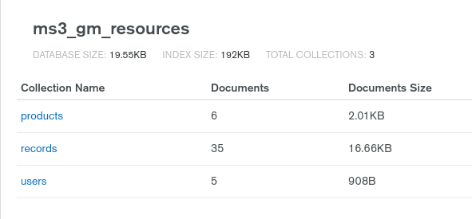

<a href="https://ms3-gm-resources.herokuapp.com/" target="_blank">View the live project here</a>


# Contents <!-- omit in toc -->  
- [Scenario Outline](#scenario-outline)
- [User Experience](#user-experience)
  - [User Stories by User Type](#user-stories-by-user-type)
    - [First-time or Infrequent Vistor](#first-time-or-infrequent-vistor)
    - [Contributing or Frequent User](#contributing-or-frequent-user)
    - [MS3 Seeds Admin User](#ms3-seeds-admin-user)
    - [Site Owner](#site-owner)
- [Design - UI](#design---ui)
    - [Colour](#colour)
    - [Typography](#typography)
    - [Images](#images)
      - [Cards](#cards)
- [Design - Database](#design---database)
- [Features](#features)
- [Technolgies Used](#technolgies-used)
- [Testing](#testing)
- [Known Issues](#known-issues)
- [Deployment](#deployment)
    - [Deploy to Heroku](#deploy-to-heroku)
    - [Connect MongoDB and Create PyMongo Instance](#connect-mongodb-and-create-pymongo-instance)
      - [Note on Environment Variables](#note-on-environment-variables)
  - [Forking](#forking)
- [Credits](#credits)
- [Notes](#notes)
- [Appendix](#appendix)

# Scenario Outline
This is the (fictional) scenario for which the site exists:

**MS3 Seeds** is a niche supplier of seeds, specialising in <a href="https://en.wikipedia.org/wiki/Green_manure" target="_blank">green manures</a>.
It has set up this site to do the following:
* Generate awareness for their company among the relevant community of growers
* Establish their name as being recognized as a thought leader in the area
* Establish their name as being a trustworthy and open source of unbiased information as well as quality seeds
* Generate customers by facilitating an easy through-flow from the information-sharing site to the store
* Build a community of growers who automatically think 'MS3 Seeds' when they think of green manure

# User Experience
There are 3 user types  currently envisaged for the site:
* Infrequent or first-time vistor who has not registered as a user
* Contributing users who may add posts or comment on other contributors' posts
* Admin user who represents MS3 seeds in the posts and comments and who also has the ability to add or update the specific products shown as available from MS3 Seeds

## User Stories by User Type
### First-time or Infrequent Vistor
* As a first-time visitor, the purpose and overall content of the site is clear and easy to navigate
* I want to easily browse the site for posts and/or products that I may be interested in
* I can search for a term and see results in user posts and separately, results in the 'MS3 Seeds' product information
* I can read all content but I cannot comment on posts
* The site feels informative, authorative, and welcoming
* I can contact MS3 seeds directly from the site without having to register as a user
* I can see additional contact info - phone, address, social media
* I can easily register to become a contributing user of the site
* As a grower, I can see valuable, relevant information, including:
    * Common and latin name
    * Growing season
    * N-fixing ability of a species
    * Seeding rate
    * Main benefits
    * Cost
    * Experiences of other growers/photos  

### Contributing or Frequent User
* I can easily see the latest posts that have been added to the site, allowing me to recognize immediately if new content has been added
* I can view posts by other users and comment on any posts that interest me or where I want to communicate with the poster
* For any post that interests me, I can easily navigate from the post directly to the relevant MS3 product or products that contain the species that is the topic of the post. This may be to get purchase information, or to consult the additional information provided by MS3 Seeds on that particular seed type
* I can easily log in and add a post
* I can add an image url for the species that is the topic of my post
* I can see and go to the source of any images in other user posts. *A future feature would allow direct upload of images as preferable to hot-linking*
* On my profile page, I can see all posts that I have previously submitted and can navigate directly to any of them
* I can choosse to update or delete any post that I have previously submitted
* I cannot easily delete a post by mistake as there is a confirmation required
* I feel like a valued member of the discussion community with a custom message from MS3 Seeds on my profile page
* If I have any website issues, I can use the contact form without being logged in to submit a support request
    
### MS3 Seeds Admin User
* I have all the post/comment functionality of a contributing user
* In case of an offending post, I have the option to delete that post, regardless of user - **not implemented yet**
* In addition to the post/comment functinoality of a contributing user, I also have the option to administer the products. That means, I can add details for a new product, update existing details for a product (add or remove a particular species from a seed mix, for example) or delete a product from the list.

### Site Owner
* The site presents a positive image for the brand
* The site facilitates the emergence of a discussion community around green manures with the brand name central to that discussion
* Sales Generation: When any user adds a post, they must enter the 'common name' of the plant species that is the topic of their post. This is automatically used as a search criteria against all seed mixes and a link is automatically inserted on the post to link readers to the corresponding product. 

# Design - UI
The site revolves around meaningful content. As such, the design should not get in the way of clear communication. 
Furthermore, as organic growers or farmers, users are probably not 24/7 internet users - the interface should be clean and easy to follow and any forms easy and straighforward to fill out.

### Colour
In line with the site content, the main colours used are teal, gold, white.

### Typography 
** To be decided ** I 

### Images
Images are a central part of the site 'data'. As they convey information and are not simply a design element, they are used sparingly outside of the dedicated image spaces.
The main image for the jumbotron has an overlay to prevent easy identification of the species but allow the theme of the site to come through. To make it clear that the jumbotron image is 'design' and not 'content', the same image is used on different pages regardless of species.
To differentiate pages that arise from the MS3 Seeds shop, the overlay becomes white rather than the default dark.

#### Cards
Latest posts are displayed as (Bootstrap) cards with image tops. The image in the card should match the image provided by the user for that post. However, the *Image URL* field is not mandatory for a user post. Therefore, as there may be cards that do not have a specified image, a default image is used. This keeps the presentation of the latest posts correct. Only one default image is used and it is quite unspecific, indicating to the user (especially any frequent user) that it is a default image.

**Note:** The deafult/fallback image is used only for the cards - inside the post itself, no image appears unless it has been specified by the user.

# Design - Database


The app uses MongoDB as the database. MongoDB is a NoSQL (non-relational) database and stores data in documents, as opposed to the tables of traditional relational databases. As such, it is capable of working with unstructured data. While the database is non-relational - connections between database 'collections' are established to aid clear data structure and avoid any future issues regarding the MongoDB size limit for a single document (16MB). 

Essentially, the design was set up in accordance with the following MongoDB principle "data that is accessed together should be stored together". The rationale here is that if all the data returned for a given query can be returned in a single call to one db document, it allows for very fast/efficient operation. Along with this, manual references are established between collections to allow easy follow-on queries where these are likely. (For more info, see: https://docs.mongodb.com/manual/reference/database-references/#std-label-document-references)

An example of this in practice in the app is the record for a single user post:
 

* The entry for the record embeds the comments for that record. The comments are displayed together with the rest of the post content and the use case for the app makes it unlikely that there would ever be sufficient comments to approach the document size limit.
* Each comment entry is itself an object containing the 4 key:value pairs - comment text, commenter ID, date, and user name. The commenter_id is a reference to an ObjectId in the users collection.
* A similar approach is taken with the 'conatained_in' key. This is an array of objects, with each object containing two key:value pairs. The first key value is the product_name for display together with the rest of the post data (no separate query required to get this). The second key:value pair contains the product_id as an ObjectId in the products collection.


# Features

# Technolgies Used

# Testing

# Known Issues 

# Deployment
The deployment steps below are the procedure followed for this app. 
The order of steps is based on that followed for the task manager walkthrough project.
** Note: The required environment variables are not contained in the README. ** 

### Deploy to Heroku
1. Create a requirements.txt file. In (Gitpod) terminal, type:
   ```shell
   pip3 freeze --local > requirements.txt
   ```
2. Create a Procfile. (This step also creates  __pycache__ ). 
   In the terminal, type:
   ```shell
   echo web: python app.py > Procfile
   ```
3. Remove any stray blank line at the end of the Procfile.
4. Go to Heroku.com and log in.
5. Choose *New* -> *Create New App*
6. Enter an app name.
7. Choose the region (Europe).
8. Click *Create App*.
9.  On the *Deploy* tab, choose Github as the deployment method but do not deploy yet!
10. Find the Github repo for the app and connect.
11. Configure the secret keys corresponding to the values in the *env.py* for the app. Do this in *Settings* -> *Config Vars*. Enter values for IP, PORT, SECRET_KEY, MONGO_URI, MONGO_DBNAME. Note: The value for MONGO_URI must be retrieved from the MongoDB account (cluster) being used for the app. Hide the config vars.
12.  Back in the Gitpod workspace, commit and then push the Procfile and requirements.txt files created in steps 1 and 2.
13.  In Heroku, go to the *Deploy* tab and enable automatic deploys. This means that updates pushed to the Github repo are automatically mpped to Heroku.
14.  Go to manual deploys -> Deploy branch (master).

### Connect MongoDB and Create PyMongo Instance
(Official documentation: https://flask-pymongo.readthedocs.io/en/latest/)

The steps below assume you have a MongoDB account and a cluster available to connect the app.

1. Install Flask PyMongo by typing the following command in the terminal:
   ```shell
   pip3 install flask-pymongo
   ```
2. Install dnspython:
   ```shell
   pip3 install dnspython
   ```
3. Make sure these are added to the app requirements:
   ```shell
   pip3 freeze --local > requirements.txt
   ```
4. Add PyMongo to the app. 
   In app.py, add:
   ```py
   from flask-pymongo import PyMongo
   from bson.objectid import ObjectId
   ```
5. Get the connection string from MongoDB:
   1. Log in to your MongoDB account.
   2. Choose *Cluster* -> *Connect*.
   3. Choose *Connect your application*.
   4. Verify the driver (Python) and the version (3.6 or later).
   5. Get the connection string and add it to the env.py file:
      ```python
      os.environ.setdefault("MONGO_URI", "<connection string>")
      ```
6. In app.py, configure the connection (these values must correspond with those entered in Heroku config vars):
   ```python
   app.config["MONGO_DBNAME]=os.environ.get("MONGO_DBNAME")
   app.config["MONGO_URI]=os.environ.get("MONGO_URI")
   app.secret_key=os.environ.get("SECRET_KEY")
7. Make sure to add the MONGO_URI connection string info to the config vars in Heroku.
8. Create a PyMongo instance to connect the app and the database. In app.py, add:
    ```python
    mongo = PyMongo(app)
    ```
## Deploying Locally
To download the code and open it in your own IDE, do the following:
1. On the repository home page on Github, find the download code button above the table with the commit history and open the dropdown menu.
2. Choose * Download ZIP*.
3. Locate the download in the *Downloads* folder on your computer and store it in a suitable dedicated folder.
4. Extract the ZIP.
5. Open the project files from your IDE. For example, if using VSCode, choose *File* -> *Open Folder* and choose the folder just created in step 4.

#### Note on Local Deployment:

To run the app from the copied files would require that you have installed all required components in your development environment, for example Flask and PyMongo. Requirements are listed in the requirements.txt file.
In a clean environment, you can install all the requirements together using the following command:

   ```shell
   pip3 install -r requirements.txt
   ```
   (pip or pip3? Either is ok, depending on your Python version. If you have Python 3, use pip3. For more, see: https://techwithtech.com/python-pip-vs-pip3/ )

If you already have some packages installed, you can install packages individually, for example:
   * To install flask:
      ```shell
      pip3 install Flask
      ```
   Official Documentation: https://flask.palletsprojects.com/en/1.1.x/installation/
   * To install PyMongo: 
      ```shell
      pip3 install flask-pymongo
      ```
   Official documentation: https://pymongo.readthedocs.io/en/stable/

#### Note on Environment Variables

Running the app locally requires that you have access to the environment variables. These are stored in a .gitignore file and are not provided in the README or as part of the downloaded ZIP. For MS3 grading, these are provided separately for the tester.

## Forking
If you have a Github account, you can fork the repository to your own account. This will create a copy with which you can then work.
The proviso above regarding environment variables also applies in this instance.
To fork your own copy of the repository:
1. While in the repository you wish to fork (ie, this one), click the *Fork* icon in the top-right corner of the screen.
2. You can confirm whether you want to use the fork as a basis for your own project or as a copy via which to contribute to the original (using pull requests).

**The proviso above regarding environment variables also applies in this instance.**

Full deatils about forking a Github repository can be found here: https://docs.github.com/en/github/getting-started-with-github/fork-a-repo


  
# Credits

# Notes
* Turn off debug mode before submitting - in app.py
* Password for secret key created using randomkeygen
* Favicon from https://iconarchive.com/browse.html

# Appendix
Background:
Green manures and cover crops are an important part of land management for horticultural enterprises, particularly in an organic context. They have numerous benefits - for example, some green manures fix nitrogen from the air and reduce the need for the application of synthetic fertilizer. Others may be beneficial for pollinating insects or for soil conditioning.

There are many different species and species mixes that are considered green manures or cover crops and each one has a particular application and is suited for different conditions. For example, some are for winter growing, others for summer. Some summer green manures die back naturally with cold weather, others need to be stopped/killed before the next crop can be sown.