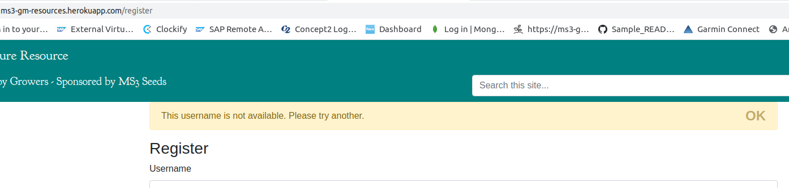

- [Testing for MS3](#testing-for-ms3)
  - [Tests For First-Time or Infrequent User](#tests-for-first-time-or-infrequent-user)
    - [As a first-time visitor, the purpose and overall content of the site is clear and easy to navigate](#as-a-first-time-visitor-the-purpose-and-overall-content-of-the-site-is-clear-and-easy-to-navigate)
    - [As a non-logged in user, I can register on the site (including client-side validation)](#as-a-non-logged-in-user-i-can-register-on-the-site-including-client-side-validation)
    - [As a new user trying to register, I cannot use a username already taken (server-side validation)](#as-a-new-user-trying-to-register-i-cannot-use-a-username-already-taken-server-side-validation)
    - [As a non-logged in user, I can use the contact form](#as-a-non-logged-in-user-i-can-use-the-contact-form)
    - [As a non-logged in user, I can search for a term and see results in user posts and, separately, results in the 'MS3 Seeds' product information](#as-a-non-logged-in-user-i-can-search-for-a-term-and-see-results-in-user-posts-and-separately-results-in-the-ms3-seeds-product-information)
  - [Appendix](#appendix)

# Testing for MS3
The testing oultined below is organised by user stories (US) (individually or grouped).
## Tests For First-Time or Infrequent User

### As a first-time visitor, the purpose and overall content of the site is clear and easy to navigate
    *  The site feels informative, authorative, and welcoming
    *  I can see additional contact info - phone, address, social media
    *  I can read all content but I cannot comment on posts

Test case steps:
   1. Go to the site URL and assess the home page. Should see clear info, easily accessible navigation, contact information in the footer and a separate contact page.
   
        Result: ok. Required elements are present and the intro information for the site is clearly presented.
   2. Open a post and check to make sure the content can be read but there is no option to leave a comment.
    
        Result: ok. I can view all the post content, including any existing comments but I cannot add a comment.
   3. Check the navigation to make sure there is no option to add a post.
    
        Result: ok
    
### As a non-logged in user, I can register on the site (including client-side validation)
Test case steps:
1. Go to the Register option in the navigation bar and register on the site, as follows:
2. Try to register without providing an email address - this should be prevented by client-side validation
3. Try to register with out a username - this should be prevented by client-side validation
4. Try to register without a password - this should be prevented by client side validation.
5. Try to register with all required fields filled - this should be successful and the app issues a message to say you have registered successfully and you are logged in. Verify you now have the option to add a post or a comment or another contributor's post.
   
    
*Result: When providing the required info I can register. When I do this, the additional navigation option to add a post is displayed and I can also add a comment on an existing post - ok.
        
However, when I try to log in without a password to match the required pattern, the HTML validation catches it but there is no message to tell me what the requirement (pattern) is - test case not 100% ok. This should be fixed using a custom JS validation function. To do.

### As a new user trying to register, I cannot use a username already taken (server-side validation)
Registration should use server-side validation to check that the entered username is not already taken.
Test case steps: 
1. After registering using the steps for creating a new user above, log out and retry using the same name and valid email/password. A message should display informing you that the username is not available.
 
Result: ok - see screenshot:

### As a non-logged in user, I can use the contact form
Any user should be able to use the contact form.
Test case steps:
1. Navigate to the Contact page.
2. Enter some values in the required fields.
3. Send the message.
4. Check for a confirmation that your message has been sent.
5. Check for an email copy of your contact submission.

Result: ok. I can add some deatils to the contact form and send it. When the message sends, a modal appears to confirm that it has sent sucessfully. Also, a copy of the contact form is received by the email address provided in the form:

### As a non-logged in user, I can search for a term and see results in user posts and, separately, results in the 'MS3 Seeds' product information

## Appendix

Initial set up followed the process usedin the walkthrough task manager app.

After setting up the Db, the config, getting the MONGO_URI string etc, testing the app raised the following error:
 - insert mongo_not_defined.png

 This was caused by a missing constructor method: 
 mongo = PyMongo(app)

 Adding this resolved the issue and page loaded correctly showing a test record from the connected db:
 - insert resolved_mongo_not_defined.png
