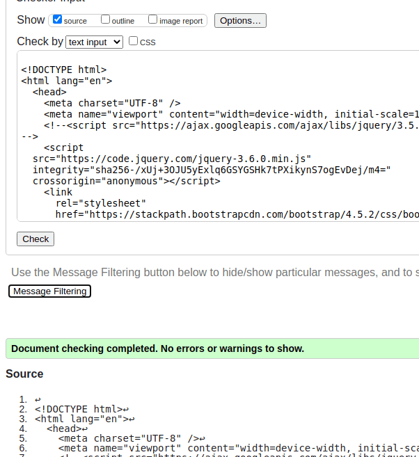

# Testing for MS3 <!-- omit in toc -->
The testing oultined below is organised by user stories (US) (individually or grouped).
Note: Testing is ongoing with final changes to the appearance of the site. Some of the screenshots may not match exactly with the submitted version in terms of the appearance.
 
- [Tests For First-Time or Infrequent User](#tests-for-first-time-or-infrequent-user)
  - [As a first-time visitor, the purpose and overall content of the site is clear and easy to navigate](#as-a-first-time-visitor-the-purpose-and-overall-content-of-the-site-is-clear-and-easy-to-navigate)
  - [As a non-logged in user, I can register on the site (including client-side validation)](#as-a-non-logged-in-user-i-can-register-on-the-site-including-client-side-validation)
  - [As a new user trying to register, I cannot use a username already taken (server-side validation)](#as-a-new-user-trying-to-register-i-cannot-use-a-username-already-taken-server-side-validation)
  - [As a non logged in user, I can use the contact form](#as-a-non-logged-in-user-i-can-use-the-contact-form)
  - [As a non-logged in user, I cannot post a comment by going directly to the url for adding a post](#as-a-non-logged-in-user-i-cannot-post-a-comment-by-going-directly-to-the-url-for-adding-a-post)
  - [As a non-registered or logged in user, I can use the Search functionality](#as-a-non-registered-or-logged-in-user-i-can-use-the-search-functionality)
- [Tests for Logged In/Contributing User](#tests-for-logged-incontributing-user)
  - [I can add a post or add a comment on an existing post when logged in](#i-can-add-a-post-or-add-a-comment-on-an-existing-post-when-logged-in)
  - [I can add a comment on an existing post when logged in](#i-can-add-a-comment-on-an-existing-post-when-logged-in)
  - [As a user who has previously submitted comments, I can choose to delete them](#as-a-user-who-has-previously-submitted-comments-i-can-choose-to-delete-them)
  - [As a user who has previously submitted comments, I have te option to edit these when logged in](#as-a-user-who-has-previously-submitted-comments-i-have-te-option-to-edit-these-when-logged-in)
  - [As a registered user who has logged in, I do not have access tothe admin functionality](#as-a-registered-user-who-has-logged-in-i-do-not-have-access-tothe-admin-functionality)
  - [As a registered user, I get a personalized message from MS3 seeds](#as-a-registered-user-i-get-a-personalized-message-from-ms3-seeds)
- [Tests For an Admin User User Stories](#tests-for-an-admin-user-user-stories)
  - [As an admin user, I can add or edit products](#as-an-admin-user-i-can-add-or-edit-products)
- [Tests for Site Owner User Stories](#tests-for-site-owner-user-stories)
    - [When a user adds a post, the app automatically adds the related product info if applicable](#when-a-user-adds-a-post-the-app-automatically-adds-the-related-product-info-if-applicable)
- [Code Validation](#code-validation)
  - [HTML](#html)
    - [Testing password-protected pages](#testing-password-protected-pages)
    - [Modals](#modals)
    - [HTML Validation Reults as of 3/5/21:](#html-validation-reults-as-of-3521)
- [Example Testing Process for HTML Validation](#example-testing-process-for-html-validation)


## Tests For First-Time or Infrequent User

### As a first-time visitor, the purpose and overall content of the site is clear and easy to navigate
    *  The site feels informative, authorative, and welcoming
    *  I can see additional contact info - phone, address, social media
    *  I can read all content but I cannot comment on posts

Test case steps:
   1. Go to the site URL and assess the home page. Should see clear info, easily accessible navigation, contact information in the footer and a separate contact page.
   
        Result: ok. Required elements are present and the intro information for the site is clearly presented.
   2. Open a post and check to make sure the content can be read but there is no option to leave a comment.
    
        Result: ok. I can view all the post content, including any existing comments but I cannot add a comment.
   3. Check the navigation to make sure there is no option to add a post.
    
        Result: ok
    
### As a non-logged in user, I can register on the site (including client-side validation)
Test case steps:
1. Go to the Register option in the navigation bar and register on the site, as follows:
2. Try to register without providing an email address - this should be prevented by client-side validation
3. Try to register with out a username - this should be prevented by client-side validation
4. Try to register without a password - this should be prevented by client side validation.
5. Try to register with all required fields filled - this should be successful and the app issues a message to say you have registered successfully and you are logged in. Verify you now have the option to add a post or a comment or another contributor's post.
   
    
*Result: When providing the required info I can register. When I do this, the additional navigation option to add a post is displayed and I can also add a comment on an existing post - ok.
        
However, when I try to log in without a password to match the required pattern, the HTML validation catches it but there is no message to tell me what the requirement (pattern) is - test case not 100% ok. This should be fixed using a custom JS validation function. To do.

### As a new user trying to register, I cannot use a username already taken (server-side validation)
Registration should use server-side validation to check that the entered username is not already taken.
Test case steps: 
1. After registering using the steps for creating a new user above, log out and retry using the same name and valid email/password. A message should display informing you that the username is not available.
 
Result: ok - see screenshot:


### As a non logged in user, I can use the contact form
Any user should be able to use the contact form.
Test case steps:
1. Navigate to the Contact page.
2. Enter some values in the required fields.
3. Send the message.
4. Check for a confirmation that your message has been sent.
5. Check for an email copy of your contact submission.

Result: ok. I can add some deatils to the contact form and send it. When the message sends, a modal appears to confirm that it has sent sucessfully. Also, a copy of the contact form is received by the email address provided in the form:


### As a non-logged in user, I cannot post a comment by going directly to the url for adding a post
The navigation option to add a post does not appear if a user is not logged in. However, they could use the url to go to the page directly. ie:
'''
http://ms3-gm-resources.herokuapp.com/add_record
'''
If a visitor attempts to post in this way, they should not be able.
Test case step:
1. Paste the url into the browser address bar.
2. Provide values to the required fields and then submit the post.
3. The post should not be accepted.

Result: ok - I get a key error: 'session_user' when trying to subvert the requirement to be logged in to make a post.
To do: Make a custom error page to handle this.

### As a non-registered or logged in user, I can use the Search functionality
Any user should be able to use the search regardless of whether they are logged in or not.
Test case steps:
1. Make sure your user is logged out.
2. Enter a term in the search bar that you know exists in the site content, for example, 'soil'.
3. Search for the term.
4. Results should be displayed in two batches - results in post content and result in product content.

Result: ok. The screenshot shows the results for a test search on 'red'. (The nonsense product names are simply placeholders.)


## Tests for Logged In/Contributing User

### I can add a post or add a comment on an existing post when logged in
Steps:
1. Log in with username and password.
2. Navigate to 'Add' to add a post.
3. Enter some values in the required fields and click submit.
4. Verify that a confirmation (flash) appears to confirm the post creation. 
5. Verify that the new post appears in teh list of latest posts on the home page.
6. Verify that you can view the post by clicking the link from the home page.

Result - All steps test ok.

### I can add a comment on an existing post when logged in
Steps:
1. Go to a post that has been entered by another (or your own user - doesn't matter).
2. Scroll down and verify that the option exists to add a comment (this is not possible if not logged in)
3. Check the HTML validation by clicking the 'Comment' button before entering any value in the comment field. This should not be allowed.
4. Add some value in the comment filed and click the Comment button again.
5. Verify that the comment appears under the post aloongside your username.

Result: All steps test ok.

### As a user who has previously submitted comments, I can choose to delete them
Steps:
1. Go to the Profile page.
2. Verify that a table exists titles My Posts. This shows a list of all posts and includes the post title and the date it was posted.
3. Make a not of the number of posts in the list.
4. Select a post and make a note of the title.
5. Click the Delete option for this post.
6. Verify that the post is not yet deleted - instead the user is presented with  modal asking them to confirm the delete action.
7. Confirm the deletion.
8. Verify that a flash message appears to confirm the deletion was successful.
9. Go to the list of posts again and verify that the length of the list has decreased by 1 and that the selected title is no longer there.
    
Result: All steps test ok and the behaviour is as expected.

### As a user who has previously submitted comments, I have te option to edit these when logged in
Steps:
1. Go to the Profile page for the user and click the edit button for a post in the list of My posts.
2. Verify that the form fields are prefilled with the existing content.
3. Add or change the information for a single field while making a note of the content of another field which you will not change.
4. Click Edit.
5. Verify that the content you edited has been changed and the fields that were not edited have not been changed.
   
Result: All steps test ok and the behaviour is as expected:


### As a registered user who has logged in, I do not have access tothe admin functionality
MS3 Seeds admin users have the option to edit Product entries. This depends on the ``` user_is_admin ``` value stored for the user in MongoDB.
When this is ```"yes"```, the user can add or edit products. otherwise, they can add posts and comments only.
Steps:
1. Log in as a user that is not an admin.
2. Go to the Products page.
3. Verify that there is no option to add a new product or edit/delete existing products.

Result: The behaviour here is as expected. Logged in as a non-admin user, there is no option to add, edit, or delete products.

### As a registered user, I get a personalized message from MS3 seeds
The app checks the number of posts a user currently has and gives a message on their profile page. If the number is low, the message is different to that seen by a user who has contributed often.
1. Verify that when logged in as a user with 5 or less posts, the app displays a corresponding message.
2. Add more posts and verify that when the number reaches a threshold (6), the message changes.

Result: Tests ok


## Tests For an Admin User User Stories

### As an admin user, I can add or edit products
User story to test:
> In addition to the post/comment functionality of a contributing user, I also have the option to administer the products. That means, I can add details for a
>  new product, update existing details for a product (add or remove a particular species from a seed mix, for example) or delete a product from the list.

Steps:
1. Log in as an admin user.
2. Verify that the same functinoality in relatino to posts and comments is still available as it is for a logged-in but non-admin user.
3. Naviage tot he Products page.
4. Verify that buttons exist to add a new product and edit or delete existing products.
5. Add a new product by clicking the Add new Product button and provifding the required details.
6. Verify that the product shows up in the list.
7. Edit the product clicking the edit button and then adding or removing some content.
8. Save the edit and verify that the changed product details have been saved.
   
Result : Ok. All steps test ok.

## Tests for Site Owner User Stories
The main point for the site owner is that the site looks and functins well. In terms of testing functinality, there are a few things to check that add to the overall experience of the site and enhances the benefit for the owner iin terms of generating customers.

#### When a user adds a post, the app automatically adds the related product info if applicable
The full description here is that when a regular user adds a new post and adds a species 'common name' to the required 'common name' field, the app automatically checks if this name is contained in any of the maintained listings for the various product contents. So, is species 'mustard' is an element of product mixes 'Meadow Mix and 'Bee Heaven' and if a user adds a post about mustard - these two products are automatically linked from the post.

Test steps:
1. Check the species listing for a product and make a note of one of the species. (For example, product 'Bee Heaven' contains buckwheat.)
2. Go to the Add page and add a new post. Enter the species from step 1 in the 'common name' field.
3. Enter some dummy values for any other required fields and create the post.
4. Go to the latest posts and open the link for the newly added post.
5. Check the table row named 'Products containing this seed' and verify that the product containing the species is listed and is available via a link. A link to the overall products page is also available, even if there is no product mix. 

Result: ok app performs as expected:


## Code Validation

### HTML
Most of the HTML testing went smoothly. However, there were a couple of issues that required some work.

#### Testing password-protected pages
Typically, I used the check by addres option in the NuHTML Checker. However, this does not work with pages that are password-protected - such as a user's profile page when the user is logged in.
An online search showed this to be the expected behaviour of the checker for security reasons:
[Related Link 1](https://lists.w3.org/Archives/Public/www-validator/2019Jan/0014.html)
[Related Link 2](https://lists.w3.org/Archives/Public/www-validator/2019Jan/0015.html)
[Related Link 3](https://stackoverflow.com/questions/2052580/validate-markup-of-password-protected-sites-with-w3c)

To get around this and validate the required pages, I chose to **View Source** on the page and pasted this into the checker using the text input option. It seems to have worked well as a workaround. The alternative would be to download a local copy othe checker but time didn't allow to follow this course.


#### Modals
To generate modals for the delete confirmation functionality for a user post or a product (for admin user), a set of modals were generated inside the same jinja for loop as was used to generate rows in the table displaying the posts.
This worked fine but did not pass the html validation as I could not not place the div element inside the ```<table>``` or ```<tr>```. If I placed the modals inside a ```<td>```, it led to issues with their display. To manage this, a new div was created above the table to house the modals. These are now generated in a separate jinja for loop ut based on the same list as the table rows. The HTML is now valid and the functionality works as expected.

#### HTML Validation Reults as of 3/5/21:
Page | Type of Check | Result
-----|---------------|-------
https://ms3-gm-resources.herokuapp.com/ | URL | Document checking completed. No errors or warnings to show.
http://ms3-gm-resources.herokuapp.com/products | URL | Document checking completed. No errors or warnings to show.
http://ms3-gm-resources.herokuapp.com/register | URL | Document checking completed. No errors or warnings to show.
http://ms3-gm-resources.herokuapp.com/login | URL | Document checking completed. No errors or warnings to show.
http://ms3-gm-resources.herokuapp.com/contact | URL | Document checking completed. No errors or warnings to show.
http://ms3-gm-resources.herokuapp.com/search_res | URL | Document checking completed. No errors or warnings to show.
http://ms3-gm-resources.herokuapp.com/profile/jc_test1 | Text Input | Document checking completed. No errors or warnings to show.
http://ms3-gm-resources.herokuapp.com/add_record | Text Input | After fixes: Document checking completed. No errors or warnings to show.
http://ms3-gm-resources.herokuapp.com/products (As logged in admin) | Text Input | Document checking completed. No errors or warnings to show.
http://ms3-gm-resources.herokuapp.com/show_record/608fccbf5365a8fea1715b2f | URL | After fixes: Document checking completed. No errors or warnings to show.
http://ms3-gm-resources.herokuapp.com/edit_record/608fd31bb78ab696c9c2e78a | Text Input | See example case below. After fixes: Document checking completed. No errors or warnings to show.
http://ms3-gm-resources.herokuapp.com/edit_product/60741ece45ff995cf845f6b4 | Text Input | Document checking completed. No errors or warnings to show.
http://ms3-gm-resources.herokuapp.com/show_product/60741ece45ff995cf845f6b4 | URL | After fix: Document checking completed. No errors or warnings to show.


## Example Testing Process for HTML Validation

Logged in? Yes

Page to be tested: 'Edit Post' - in this case http://ms3-gm-resources.herokuapp.com/edit_record/608fd31bb78ab696c9c2e78a

*View source* for the page and check this by copy/pasting into the text input in the checker.

**Results:**


* **Error: Any input descendant of a label element with a for attribute must have an ID value that matches that for attribute. (2)**
  * Straighforward fix to align label and ID values. This oocurs in the radio section of the form and a similar fix was already implemented for the 'Add post' page.

* **Attribute type not allowed on element textarea at this point.**
  * Ok - checked this and type is not a valid or required attribute for ```<textarea>```. See [HTML Spec](https://html.spec.whatwg.org/multipage/form-elements.html#the-textarea-element).
  * Fix: remove the attribute

* **The element button must not appear as a descendant of the a element.**
  * Checked this and have it fixed on other pages earlier. The ``` <a> ``` tag cannot contain a button. The fix I have iplemented is to use a Bootstrap class on the href.
  That involves changing as follows:
    
**From:**

```html
        <a href="{{ url_for('show_profile', username = session['session_user'])}}">
                  <button type="button" class="btn btn-default">Cancel</button></a> 
```

**To:**

```html
        <a href="{{ url_for('show_profile', username = session['session_user'])}}" 
        class="btn btn-default">Cancel</a>
```

* **The value of the for attribute of the label element must be the ID of a non-hidden form control. (6)**
  * OK this is a straighforward realignment of the label and ID values.

After making the required changes to the file in GitPod, changes are saved, committed, and pushed to GitHub. From there they are auto-deployed to Heroku and the live site. Then retest the live site by repeating the view source copy/paste into the NuHTML checker.
Result this time is no errors:

 
